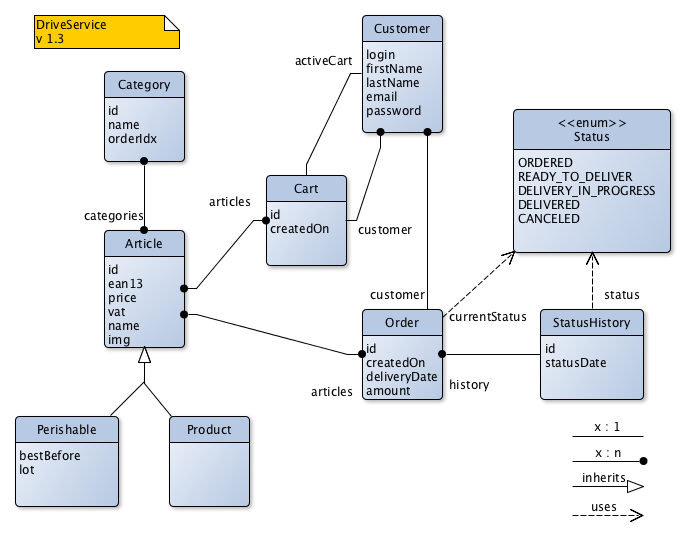

# Exercice 3/01

Consulter le modèle UML suivant :

Quelques précisions sur le modèle :

* Article

Les identifiants seront numériques (int).  
L'EAN est le codebarre de l'article, codé sur 13 caractères.  
Le prix est un entier représentant le prix en centimes.  
vat est le taux de tva. (0.20 = 20%).  

* Category

orderIdx est un entier qui permettra de trier les produits selon un ordre donné par l'administrateur.  

* Perishable

lot représente un texte permettant de dissocier les livraisons de produits frais.  

## TODO

* Créer les classes de ce modèle dans un package "fr.eservices.drive.model" en utilisant les noms exacts des attributs
* Ajouter les annotations JPA à ces classes
* Implémenter les méthodes de CatalogDao dans CatalogDaoJPAImpl

Vous devriez être en mesure de lancer les tests :

* test.model.ModelAttributes
* test.model.JpaAnnotations
* test.model.JpaContext
* test.dao.CatalogDaoTest

